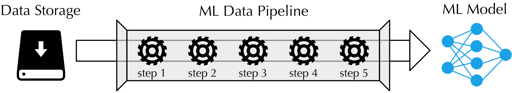
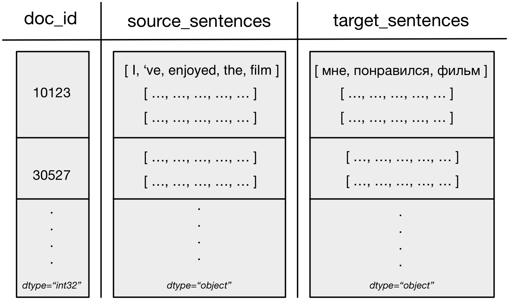

# Machine Learning Data Pipeline (MLDP) #

This repository contains a module for **parallel**, **real-time data processing** for machine learning purposes.
Essentially, it provides an infrastructure for efficient parallel data processing for models **development (training, testing)**, and **production**. A data pipeline can be understood as a sequence of computational steps that are applied to data-chunks that are read progressively (opposed to reading all data to the main memory at once), as shown below. The final output of the data pipeline are data-chunks (batches) in a desired format, which will depend on a model at hand.



As opposed to a common meaning of data pipeline, the module focuses on providing data-chunks in real-time, as fast as possible, assuming that a data processing procedure might change over the course of experiments series.

Because similar computational steps can in principle be applied to different ML projects, the main problem is that it's not straightforward to apply them to data in different format.
Fortunately, the pipeline passes a light-weight intermediate data format across steps. Therefore, **computational steps can be reused** as their input will always be of the same format regardless of whether your data is in csv, xml, or some other format.

Finally, a need for experiments reproducibility is considered by **documentation generation**. Such that it would be possible to rerun an older experiment and obtain the same results, or simply lookup what setup has been used in a previous model run. To facilitate that, the module allows documentation generation of pipeline setups and individual components that were used to process data.

## MLDP main features ##

* Highly scalable data processing on multi-core CPU architectures.
* Automatic documentation generation of data pipelines and individual steps.
* Code reusability of computational steps (agnostic to an input data format).
* Ease of custom steps integration to the module.
* Complete independence of other machine learning libraries, such as TensorFlow.
* A set of implemented steps that can be used out-of-the-box for data processing, such as a csv reader, vocabulary mapper, padder, and token processor.

The module does not provide an exhaustive set of computational steps, and a user has a complete freedom to write own steps in a pure Python, and use any extra libraries that he might wish.

## Installation ##

```python
pip install machine-learning-data-pipeline
```

Alternatively, clone the repository, and from its root directory run:
```python
pip install .
```

It was fully tested on Python 2.7.13

## Usage ##

### Example ###
```python
from mldp.pipeline import Pipeline
from mldp.steps.readers import CsvReader
from mldp.steps.transformers import TokenProcessor, FieldsSelector, Padder

data_path = "mldp/tests/data/tweets.csv"

# creating steps
csv_reader = CsvReader(sep='\t', chunk_size=30)
fields_selector = FieldsSelector(field_names=["tweets", "labels"])
token_processor = TokenProcessor(field_names="tweets",
                                 tokenization_func=lambda x: x.split(),
                                 lower_case=True)
padder = Padder(field_names="tweets", pad_symbol="<PAD>")

# creating the pipeline
pipeline = Pipeline(reader=csv_reader, worker_processes_num=1)
pipeline.add_step(fields_selector)
pipeline.add_step(token_processor)
pipeline.add_step(padder)

# iterate over data chunks
for data_chunk in pipeline.iter(data_path=data_path):
    pass

# generate documentation and print it
print(pipeline)
```

### Implementation of custom steps ###

In order to implement custom steps, the user has to extend base classes of a desired step. For example, to write a custom reader, the user needs to extend **BaseReader** from **mldp/steps/readers/base_reader.py**.

Please remember that all steps are required to output data-chunks in the **intermediate format** as explained below.

### Tutorials ###

For a more detailed presentation of the module's features and applications, please refer to the <a href="/tutorials">tutorials folder</a>.

## Main principles ##

### Computational step types ###

1. **Readers** - fetch data from a remote or local storage and convert it to the intermediate data-chunk format (dict of numpy arrays). E.g., CSV files or JSON readers.
2. **Transformers** - transform field values of data-chunks or create new data-chunk fields. E.g. a Padder that makes all sequences to be of the same length.
3. **Formatters** - convert the intermediate data-chunk format to a project specific data format. E.g. steps that convert to pandas data-frames or tuples (features, labels).
4. **General**  - a special case steps, at the moment only the data chunk size adjuster that allows to change the size of data-chunks in the middle of a pipeline.
5. **Preprocessing** - while preprocessing is not the main focus of the module, steps of this kind allow to perform data alteration and caching for multiple subsequent re-use during processing steps execution. For example, a step of this kind could pre-load remote data, or perform some data cleaning. Operations in this step are usually necessary to execute only once, then save the result, and use it for processing runs without re-execution of the step.


### Intermediate format ###

The MLDP restricts the format of data-chunks that travel along the pipeline to be **dictionaries of numpy arrays** of arbitrary types and shapes, with the following rational:

1. Potential to apply fast vectorized operations on numpy arrays.
2. Code re-usability of steps. Namely, if a step is implemented once, it can be re-used in different projects regardless of input data format (under mild assumptions).

Data-chunks have **field_names** (dict keys) corresponding to data attributes (e.g. "text_ids", "texts", "labels"). And **field_values** (dict values) corresponding to data-unit values, for example the actual *text ids* or *text* strings. While *field_values* are restricted to be numpy arrays, their actual elements can be of arbitrary types, and thus any data can be frames easily into the format.

An example data-chunk for machine translation is shown below.



The shaded rectangles correspond to numpy arrays of different types but with the same first dimensionality. Note that numpy arrays can contain arbitrary types besides standard floats and ints.

## License ##

Attribution-NonCommercial 4.0 International
